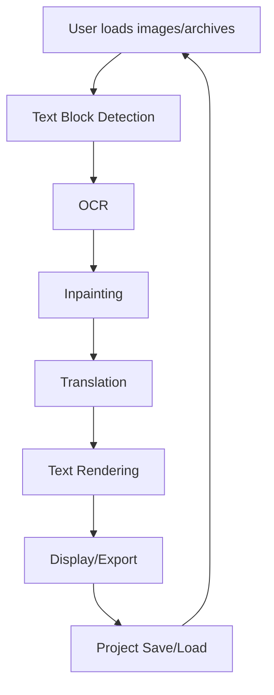
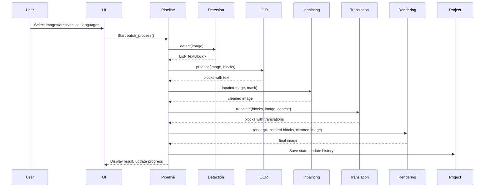

# How It Works

## High-Level Workflow

1. **User loads images or comic archives** (CBZ, CBR, PDF, EPUB, etc.) via the GUI.
2. **Text block detection**: Speech bubbles and text regions are detected using deep learning models (e.g., RT-DETR-V2).
3. **OCR**: Detected regions are passed to the selected OCR engine (doctr, manga-ocr, Pororo, PaddleOCR, GPT-4 Vision, etc.) to extract text.
4. **Inpainting**: The original text is removed from the image using inpainting models (LaMa, AOT, MI-GAN).
5. **Translation**: Extracted text is translated using the selected engine (LLM or traditional).
6. **Text rendering**: Translated text is rendered back into the cleaned image, matching the original style and layout.
7. **Project management**: All state (images, translations, settings) can be saved/loaded as a project file (.ctpr).

---

## Detailed Data Flow

---

## Step-by-Step Breakdown

### 1. Loading Images/Archives
- User selects files via drag-and-drop, file browser, or project file.
- Supported formats: images (PNG, JPG, etc.), comic archives (CBZ, CBR, CB7, CBT, ZIP, RAR, 7Z, TAR), PDFs, EPUBs.
- Archives are extracted to temporary directories; images are listed for processing.

### 2. Text Block Detection
- Uses deep learning models (default: RT-DETR-V2) to detect speech bubbles and text regions.
- Handles extremely tall images (webtoons) by slicing and recombining results.
- Output: List of `TextBlock` objects with bounding boxes, angles, and metadata.

### 3. OCR (Optical Character Recognition)
- Each detected region is passed to the selected OCR engine.
- Supported engines:
  - **doctr**: For English, French, German, Dutch, Spanish, Italian.
  - **manga-ocr**: For Japanese.
  - **Pororo**: For Korean.
  - **PaddleOCR**: For Chinese.
  - **GPT-4 Vision**: For Russian and optionally other languages (API key required).
  - **Google Cloud Vision, Microsoft Azure Vision**: Optional, API key required.
- OCR results are cached (see PR #303) to avoid redundant computation.
- Output: `TextBlock` objects updated with recognized text.

### 4. Inpainting (Text Removal)
- Selected inpainting model (LaMa, AOT, MI-GAN) removes detected text from the image.
- Mask is generated from detected text regions.
- Output: Cleaned image with text removed, plus patches for rendering.

### 5. Translation
- Extracted text is translated using the selected engine:
  - **LLM-based**: GPT-4, Claude, Gemini, Deepseek, Custom (API keys required).
  - **Traditional**: Google Translate, Microsoft Translator, DeepL, Yandex.
- LLMs can use the entire page text and optionally the image for context.
- Output: `TextBlock` objects updated with translated text.

### 6. Text Rendering
- Translated text is wrapped and rendered into the cleaned image.
- Font, color, size, outline, and alignment are configurable.
- Rendering matches the original bubble/box layout as closely as possible.
- Output: Final translated image.

### 7. Project Management
- All state (images, translations, settings, history) can be saved as a `.ctpr` project file.
- Projects are serialized using msgpack and zipped with unique images and patches.
- Projects can be loaded to restore the full state, including undo history and settings.

---

## User Experience

### Automatic Mode
- User selects images/archives and target language.
- Pipeline runs end-to-end: detection → OCR → inpainting → translation → rendering.
- Results are displayed in the viewer and can be exported or saved as a project.

### Manual Mode
- User can intervene at any stage:
  - Manually adjust detected boxes.
  - Edit OCR results.
  - Edit or override translations.
  - Redraw inpainting masks.
- Undo/redo is supported for all actions.
- Manual corrections are saved in the project state.

---

## Caching and Performance
- **OCR Caching**: Results are cached per image/model/language/block to avoid redundant computation (see PR #303).
- **Batch Processing**: Multiple images can be processed in sequence, with progress tracking and error handling.
- **Memory Management**: Only a limited number of images are kept in memory; others are loaded on demand.

---

## Internationalization
- All UI strings are translatable via Qt .ts files in `app/translations/`.
- Language can be changed in settings; translation files are loaded at runtime.
- Community-contributed translations are supported.

---

## Technical Details

### Factories and Extensibility
- **Detection, OCR, Inpainting, Translation**: All use factory patterns and abstract base classes. New models can be added by implementing the base class and registering in the factory.
- **UI**: Modular widgets and commands allow for easy extension of the interface.
- **Project State**: Project save/load is versioned and extensible for future features.

### Project File Format
- `.ctpr` files are zip archives containing:
  - `state.msgpack`: Serialized project state (image list, settings, history, etc.).
  - `unique_images/`: All unique images used in the project.
  - `unique_patches/`: Inpainting patches.

---

## Example: Batch Processing Flow

---

## Error Handling
- Skipped images (due to detection/OCR/translation errors) are logged and can be reviewed.
- User is notified of errors and can retry or manually correct.

---

## Summary

This project provides a robust, extensible, and user-friendly platform for translating comics using the latest AI models. Its modular architecture, caching, and project management features make it suitable for both casual and professional use, supporting a wide range of languages and comic formats. 